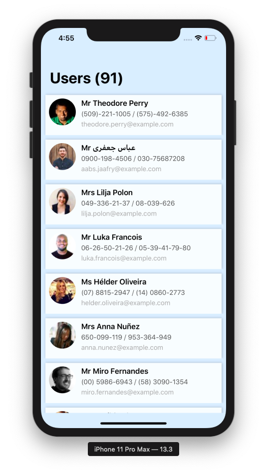

# MVVM Design Pattern
MVVM design pattern in Swift 5 and Xcode Version 11.3.1 (11C504).

## What is MVVM?
MVVM *(Model View ViewModel)* is a structural design pattern that will be guiding you in how to organize and structure your code to write maintainable, testable and extensible applications.

MVVM will enhance the separation of user interface logic from its business logic or back-end logic (the data model). Hence, it slims down massive view controllers.

## Blog
You can read more about **MVVM design pattern** by visiting following link.

https://medium.com/@milanpanchal24/an-overview-of-the-mvvm-design-pattern-ee0293663e1f

## Preview

## Author

**Milan Panchal**, follow me on:

1. **Twitter** ([@milan_panchal24](https://twitter.com/milan_panchal24))

2. **Github** ([/milanpanchal](https://github.com/milanpanchal/))

3. **Medium** ([https://medium.com/@milanpanchal24](https://medium.com/@milanpanchal24))

4. **LinkedIn** ([/in/milanpanchal/](https://www.linkedin.com/in/milanpanchal/))

License
----

MIT

**Free Software, Hell Yeah!**
